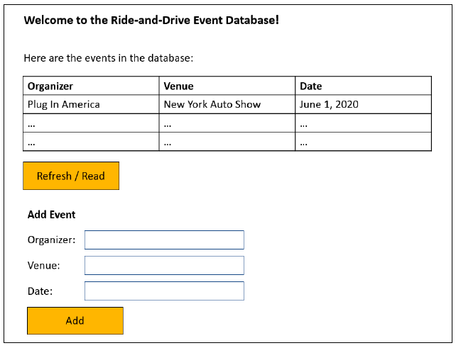

# **ZappyRide Full-Stack Engineer Skill Assessment**

http://rad-event-database.s3-website-us-east-1.amazonaws.com/

### **Ride-and-drive-Event-Database-Full-Stack**

Amazon Web Services (AWS) infrastructure, back-end development with Lambda, and front-end development (React.JS).

### **1. Infrastructure & Back-end: RAD Event API and Database**
The goal of this first part is to build a simple publicly accessible REST API with one endpoint named:
**/events**

The events endpoint needs to be able to perform the following functions via standard HTTP verbs (GET, POST, etc.):
* read - return a JSON list of all events in the database
* create - add a new event in the database
* update – update an event in the database
* delete – delete an event in the database

For simplicity, we do not require any authentication mechanism.
Each event consists of the following fields:
* organizer – string – the name of the entity organizing the event, e.g. “Plug In America”
* venue – string – the name if the venue, e.g. “New York Auto Show”
* date – string – date of the event, e.g. “June 1, 2020” (we’ll keep this as a string for simplicity)

Technology:
* Use AWS Lambda with the language of your choice (e.g. Java, Node.JS, Python, e.g.) for the API code
* AWS RDS as a database
* Connect the Lambda function(s) to the outside world, please use the AWS API Gateway

Tasks:
* Use AWS Lambda Functions to implement the functionality as describe above
* Connect your Lambda function(s) to the RDS database where the events table is stored
* Use the AWS API Gateway to create the REST endpoint for public access and connect the endpoint to Lambda

### **2. Front-end Development**
Please build a simple front-end that accesses your newly built API, sketched as follows:

Tasks:
* Build the front-end as a one-page app using ReactJS, scaffolded with npm / react-create-app
* The “Refresh/Read” button triggers a read event and displays the results
* The “Add” button triggers a create event and displays the results
* Please deploy your app on an AWS S3 bucket, and make it publicly accessible
For simplicity, we are not asking you to implement the “update” or “delete” API calls into the front-end, but feel free to do so if you’d like.
